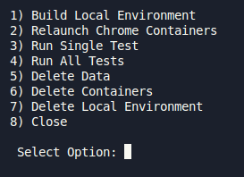

# My Skoob Automated Interface Testing

> This is a subproject of My-Skoob. While it can serve as a base for other projects, it was structured to be executed specifically alongside the system.

This project uses Python 3 with Pytest, Selenium, and Docker to run tests in parallel and in isolation.

It leverages superclasses and an intermediate class before Selenium commands so that tests inherit reusable and simplified standard methods, making development and maintenance easier.

There are also report files (where the test name is added when it fails) and data.json, which serves to standardize the information filled in during tests.

#### Images and Reports

Whenever a test fails, it is re-executed once to avoid tracking tests that failed due to random simple errors.

In the teardown method, if a test fails, it takes a screenshot and saves it in the corresponding module folder under the <a href="./prints/">prints</a> directory. The test's module and name are also added to the <a href="./reports/report.txt">report.txt</a> file. Tests that succeeded on re-run will have their name listed only once, while tests that failed (error on normal execution and on re-run) will have their name twice in the file.

## Recommendations

### Best Practices

Rules to follow to ensure a consistent standard of quality and development:

-   To find an element with Selenium, use:

    1.  element ID;
    2.  element name;
    3.  XPATH;
    4.  full XPATH;
    5.  CSS Selector.

-   Inside the main test method, only call functions;
-   Use variables for values filled in during tests;
-   Use values from data.json whenever possible;
-   Write intuitive and clear comments and modularized functions;
-   Follow the structure and comments of the example tests.

## Requirements

### Versions

|      Tool      | Version |
| :------------: | :-----: |
|     Docker     | 28.0.4  |
| Docker Compose | 2.34.0  |

#### Dev

|                Tool                 | Version |
| :---------------------------------: | :-----: |
|               RealVNC               |   LTS   |
|  VSCode Black Formatter Extension   |  Auto   |
| VSCode Prettier Formatter Extension |  Auto   |

### .env

Follow the <a href="./.env_sample">.env_sample</a> file to run the project locally.

### RealVNC

In RealVNC, register the Chrome nodes to view the test executions. Save the following addresses:

-   localhost:5900
-   localhost:5901
-   localhost:5902

And use the default password: `secret`.

## Running

It is necessary to allow the execution of scripts <a href="./menu.sh.sh">menu</a> by running:

```bash
chmod +x ./menu.sh
```

Now, just run:

```bash
./scripts/menu.sh
```

> some commands will ask for sudo permission

And you will see:



> A set of useful options

## Problemas e To-Do

-   [ ] Configurar gitlab runner;
-   [ ] Configurar github runner;
-   [ ] Add tests;
-   [ ] Add Selenium Debug.
-   [ ] Add Selenium Video.

<h6 align="center">by David Propato <a href="https://github.com/Propato">@Propato</a> </h6>
